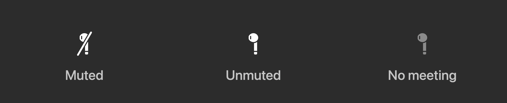

# TapMute

[English](README.md) | 日本語

EarPods の中央ボタン（再生/一時停止）で **Zoom / Google Meet / Microsoft Teams** のミュートを
切り替える macOS メニューバーアプリ。

会議が検出されているときだけメディアキーを横取りし、それ以外は下流にそのまま流すので、
会議していないときのボタンはこれまでどおり音楽の再生/停止として働く。



設計書の前提が実機と食い違った点と、それをどう作り直したかは
[実測メモと設計判断](docs/findings.ja.md)にまとめてある。

---

## 通信しない

ネットワーク通信を一切しない。通信 API はコード中に 1 箇所も無く、次で確認できる。

```sh
git grep -n -E "URLSession|NSURLConnection|Network\.|socket|http" -- Sources
```

（システム設定を開く `x-apple.systempreferences:` の URL 以外は何も出ない。）

読み取った情報（ウィンドウ題名、ミュート状態）はメニューバーの表示に使うだけで、保存も送信もしない。
唯一ファイルに書き出すのはメニューの「ウィンドウ一覧をログ出力」で、これはユーザーが明示的に
実行したときだけ一時ファイルとクリップボードに出す。

アクセシビリティ・入力監視・画面収録という強い権限を要求するアプリなので、
何をしていないかをここに明記しておく。

## 動作

```
EarPods 中央ボタン
   ↓
MeetingDetector（3 秒ごとにバックグラウンドで走査。キー押下時はキャッシュを読むだけ）
   ↓
会議あり ──→ NowPlayingShield が Now Playing の座を掴んでいる
             → メディアキーは Music ではなく TapMute に配送される
             → MuteController が Zoom : ⇧⌘A をそのまま送出（グローバルショートカット）
                              Meet / Teams : 前面化 → キー送出 → 元のアプリに復帰
会議なし ──→ 座を掴まない → 音楽アプリが普通に反応する
```

### なぜ「イベントを消費する」だけでは駄目なのか

素直な実装は `CGEventTap` でメディアキーを捕まえて消費することだが、**この macOS では効かない**。
実機で両方のタップ位置を試した結果:

| タップ位置 | PLAY を捕捉 | 消費した結果 |
|---|---|---|
| `cgSessionEventTap` | できる | **Music が起動する**（消費できていない） |
| `cghidEventTap` | できる | **Music が起動する**（消費できていない） |

メディアキーの now playing 配送（`mediaremoted`）は CG イベントパイプラインの外にいるため、
タップで消しても届いてしまう。「ミュートはできたのに音楽も再生される」がこれで起きる。

効くのは **Now Playing の座を奪うこと**だけ。`MPRemoteCommandCenter` にコマンドを登録し、
無音のループを再生して「いま再生しているアプリ」になると、OS は再生/一時停止を
Music ではなくこちらへ配送する。**会議中だけ**座を奪うのが肝で、常時奪うと音楽の操作ができなくなる。

座は「主張しているアプリ」ではなく **「最後に *再生を開始した* アプリ」**に渡る。
`MPNowPlayingInfoCenter` のメタデータを再送しても「開始」にはならないので、
YouTube のタブが動画を再生すると座を持っていかれ、ミュートと同時に動画も再生/停止してしまう。
無音ループに実際の `.paused → .playing` 遷移を 2 秒ごと（およびキー押下の直後）に作ることで、
座を取り返し続けている。

イベントタップは今も「押された瞬間を知る」ために使っている（配送より早く、確実に拾えるため）。
Now Playing 側のコマンドは通常は握り潰すだけの盾で、入力監視が切れてタップが動いていないときだけ
そちらがミュートを実行するフォールバックになる。

### 現在のミュート状態の読み方

**操作ボタンの文言から読む。** ボタンは常に「次にする操作」を述べるので、
「ミュートを解除」を提案していれば、いまはミュート中だと確実に分かる。実機の文言:

| アプリ | ミュート中 | 解除中 | 深さ |
|---|---|---|---|
| Zoom | 自分のオーディオをミュート解除する | 自分のオーディオをミュートする | 浅い |
| Teams | マイクのミュートを解除 | マイクのミュート | depth 20 前後 |
| Meet | Turn on microphone / マイクをオンにする | Turn off microphone / マイクをオフにする | depth 15 前後 |

同じ「解除」でも Zoom は「ミュート解除する」と繋がり、Teams は「ミュートを解除」と助詞が入る。
部分一致で拾うため、助詞入りの形を別の語として持つ必要がある。

ボタンが見つからないときの保険として、状態を述べている文言（「ミュートされた」/
「ミュート解除された」）も見る。ただし**状態の語と操作の語は混ぜてはいけない**。
「ミュート解除」は Zoom では操作（＝いまミュート中）、Teams の動画タイルでは状態（＝いま解除中）を
指すので、同じリストに入れると必ずどちらかで誤判定する。だから 2 本のリストに分けてある。

判定の回帰チェックは実機で採取した文言に対して走らせられる。

```sh
./build/probe --probe-mute-markers
```

### ブラウザのページ内容を読むには

Chromium 系（Chrome / Dia / Arc / Edge）は**ページ内容の AX ツリーを既定では作らない**。
そのままだとブラウザのウィンドウを覗いても 100 ノードほどしか無く、Meet のミュートボタンに届かない。
アプリ要素に `AXManualAccessibility` を立てると生成されるようになる
（スクリーンリーダーが使うのと同じ仕組み）。会議を検出している間だけ立てるので、常時の負荷にはしない。

なお **CoreAudio の入力稼働フラグはミュート状態には使えない**。Zoom はミュート中も
入力ストリームを掴んだままなので、常に「使用中」に見える（実測で確認済み）。
これは通話中かどうかの目安にはなるが、ミュート状態の判定には使えない。

## 対応アプリ

| アプリ | 検出方法 | ミュートの送り方 | 既定パターン |
|---|---|---|---|
| Zoom (`us.zoom.xos`) | ウィンドウ題名 | ⇧⌘A をグローバルショートカットで送出（前面化しない） | `Meeting` / `ミーティング` |
| Google Meet（Chrome / Dia / Arc / Edge / Brave / PWA） | ウィンドウ・タブ題名 | 前面化 → ⌘D → 復帰 | `^Meet\s*[-–—]` / `^Meet$` |
| Microsoft Teams (`com.microsoft.teams2`) | ウィンドウ題名 | 前面化 → ⇧⌘M → 復帰 | `Meeting` / `会議` / `ミーティング` |
| Slack ハドル (`com.tinyspeck.slackmacgap`) | 画面要素 | ミュートボタンを直接押す（前面化しない） | `Leave Huddle` / `ハドルから退出` / `Huddles actions` |

- Meet は**非アクティブタブでも検出する**。タブを一瞬切り替えて ⌘D を送り、元のタブと元のアプリに戻す。
- **Slack だけ検出も操作も方式が違う。** ハドルを始めてもウィンドウ題名が変わらないので、
  題名では捕まえられない。代わりにハドルのツールバーを AX ツリーから探す。
  この走査は題名比較よりずっと重いので、**マイクが使用中のときだけ**動かす。
  ただし既に検出済みのアプリは対象を外さない — ミュート中に入力デバイスを手放すアプリがあった場合、
  マイク条件だけだと**ミュート解除ができなくなる**（より悪い失敗）ため。
  Slack のミュートボタンは `AXPress` を持つので、キーを送らず直接押す。
  前面化しないので、Meet や Teams と違って Space も切り替わらない。
- パターンはアプリのバージョンと言語設定で変わるので、**設定画面から編集できる**。

## オーディオデバイスの自動切り替え

名前が一致するデバイスが現れたら、それをシステムの入力と出力にする。
macOS は USB ヘッドセットを挿すと**出力は自動で切り替えるが、入力は内蔵マイクのまま残す**
ことが多いので、そこを埋める。

**直前に無かったデバイスだけ**を対象にするので、手で選び直した設定を上書きしない。
名前は正規表現で照合し、設定画面から編集できる（既定は `EarPods`）。

挿した状態で、何が対象になるかを確認できる。

```sh
./build/probe --probe-audio
```

### 有線版と USB-C 版の EarPods

このアプリから見ると両者は同じはず。3.5mm 版はジャック側の回路がボタンを解釈し、
USB-C 版は HID Consumer Control を送るが、macOS はどちらも同じ `NX_SYSDEFINED` の
メディアキーに変換する。アプリが見ているのはその変換後のイベントだけ。
ただし実機で確認できているのは 3.5mm 版のみ。`make probe-keys` を実行して中央ボタンを押せば、
どんなヘッドセットでも数秒で確かめられる。

## 必要な権限

| 権限 | 要否 | 用途 |
|---|---|---|
| アクセシビリティ | 必須 | ウィンドウ走査・キー送出・前面化 |
| 入力監視 | 必須 | メディアキーの押下検知。これがないと `CGEvent.tapCreate` が nil を返して沈黙する |
| 画面収録 | 推奨 | **別デスクトップ（Space）にある会議ウィンドウの題名を読む** |

画面収録が「推奨」である理由は実機検証で分かった macOS の性質による。
`kAXWindowsAttribute` は**現在の Space にあるウィンドウしか返さない**。会議を別デスクトップに
置いて手前で作業する運用だと、AX だけでは会議ウィンドウが 0 件になり検出が沈黙する。
このアプリは次の 3 経路を束ねて回避している。

1. `kAXWindows` — 現在の Space。AX 要素が取れるので前面化やタブ操作ができる
2. `kAXMainWindow` / `kAXFocusedWindow` — 別 Space のアプリでも題名が取れる
3. `CGWindowList` — 全 Space を横断できるが、題名の取得に画面収録権限が要る

## ビルドとインストール

```sh
make            # build/TapMute.app を作る
make run        # ビルドして起動
make install    # /Applications へ配置
make clean
```

初回起動でオンボーディング画面が出る。3 つの権限をここから設定して、**TapMute を再起動**する。

### Zoom 側の設定（必須）

Zoom → 設定 → キーボードショートカット → 「ミュート/ミュート解除」の
**「グローバルショートカットを有効にする」を ON**。
これが OFF だと Zoom が最前面のときしか反応しない。

### 署名と TCC（権限が維持される仕組み）

権限は「どのアプリか」を **designated requirement** で判定して紐づく。署名方式でこれが変わる。

| 署名 | designated requirement | 再ビルド後 |
|---|---|---|
| アドホック（`-`） | `cdhash H"114f…"` | **毎回リセット**。1 行直しただけで別アプリ扱いになる |
| Developer ID / Apple Development | `identifier "io.github.genkitoyama.tapmute" and … certificate leaf[subject.OU] = <TeamID>` | **維持される** |

Makefile は `security find-identity -v -p codesigning` から Developer ID / Apple Development の
署名 ID を自動で拾って使う。証明書が 1 つもない環境ではアドホックに落ちる。

```sh
make install                              # 署名 ID を自動検出
make install SIGN_IDENTITY="Apple Development: ..."   # 明示指定
```

署名方式を切り替えた直後（アドホック → Developer ID など）は要件が変わるので、
そのときだけ権限を付け直す。古いエントリが残っていると無言で拒否されるため、リセットしてから許可する。

```sh
for s in Accessibility ListenEvent ScreenCapture; do tccutil reset $s io.github.genkitoyama.tapmute; done
```

## 検出がうまくいかないとき

1. **会議中に**メニューバー → 「ウィンドウ一覧をログ出力」。全ウィンドウの題名がクリップボードに入る
2. 会議ウィンドウの実際の題名を確認する
3. 設定 → 会議アプリ → 該当アプリの「タイトル」に、その題名に当たる正規表現を足す

ターミナルからも同じことができる。

```sh
make probe-windows                    # 検出結果と全ウィンドウ題名を出す
make probe-keys                       # メディアキーが届いているかだけを見る
./build/probe --probe-mute-markers    # ミュート判定の文言テスト
./build/probe --probe-audio           # オーディオデバイス一覧と切り替え対象
```

`probe-*` はターミナル自身の権限で動くので、アプリに権限を与える前の切り分けに使える。

### 誤検出（会議中でないのにボタンが効かない）

設定 → 全般 → **「マイク使用中のときだけ会議とみなす」** を ON にすると、
入力デバイスが誰かに掴まれているときだけ会議と判定する。
会議アプリはミュート中も入力ストリームを開いたままなので、ミュート解除もできる。

## 既知の制限

- Meet / Teams の前面化では、会議ウィンドウが別 Space やフルスクリーンにあると **Space が切り替わる**。
  macOS の仕様で、キーを届けるにはフォーカスが要るため回避できない
- 非アクティブタブの Meet は、そのブラウザウィンドウが**現在の Space にあるときだけ**見つかる
  （タブ一覧は AX 経由でしか取れないため）
- メニューバーのアイコンは EarPods の形。**現在のミュート状態**を表す

| アイコン | 意味 |
|---|---|
| EarPods（斜線あり） | ミュート中 — 押すと解除 |
| EarPods（通常） | ミュート解除中 — 押すとミュート |
| EarPods（薄い） | 会議なし — 押すと音楽の再生/停止 |
| 一時停止 | 一時停止中 |
| ⚠️ 警告 | 権限が不足している |

  状態が読めなかったときは通常表示に戻し、メニューに「状態不明」と出す。
  読めないものを状態として表示すると嘘をつくことになるため。
  `earbuds` に斜線版が無いので、SF Symbols と同じ手順（線の周囲をくり抜いてから線を引く）で合成している。

## ファイル構成

```
Sources/
  main.swift               エントリポイント / CLI プローブ
  AppDelegate.swift        起動・結線・キー押下時の分岐
  MediaKeyTap.swift        メディアキーの押下検知
  NowPlayingShield.swift   会議中だけ Now Playing の座を奪う（Music に行かせない）
  MeetingDetector.swift    会議の検出（3 秒キャッシュ + ワークスペース通知）
  MeetingProfile.swift     Zoom / Meet / Teams の差分を値として持つ
  MuteController.swift     ミュート操作の実行（前面化の往復を含む）
  AccessibilityHelper.swift AX と WindowServer のラッパー（3 経路の統合）
  MicMonitor.swift         入力デバイスの稼働状態（CoreAudio）
  AudioDevices.swift       CoreAudio のデバイス一覧と既定デバイス
  AudioDeviceSwitcher.swift 一致するデバイスが挿されたら入出力を切り替える
  StatusBarController.swift メニューバー UI とトースト
  PermissionManager.swift  権限の確認と誘導
  OnboardingWindow.swift   初回セットアップ画面
  SettingsWindow.swift     設定画面
  Preferences.swift        設定の永続化
  Shortcut.swift           "cmd+shift+a" ↔ キーコードの変換と送出
```

## 動作確認環境

macOS 26.5 / Apple Silicon で、以下を実機で確認している。

| 項目 | 状態 |
|---|---|
| Zoom (`us.zoom.xos`) | 検出・ミュート切替・状態表示 |
| Google Meet（Dia / Chrome のタブ） | 検出・ミュート切替・状態表示 |
| Microsoft Teams (`com.microsoft.teams2`) | 検出・ミュート切替・状態表示 |
| 会議外でのメディアキー素通し | 音楽アプリが通常どおり反応する |
| 会議中の Music 抑止 | Now Playing の座を奪って阻止 |
| 別デスクトップ（Space）の会議検出 | CGWindowList 経由で検出 |
| 再ビルド後の権限維持 | 安定した署名 ID で維持される |

UI 文言は日本語・英語の両方に対応している（Zoom は日本語 UI、Meet は英語 UI で実測）。
