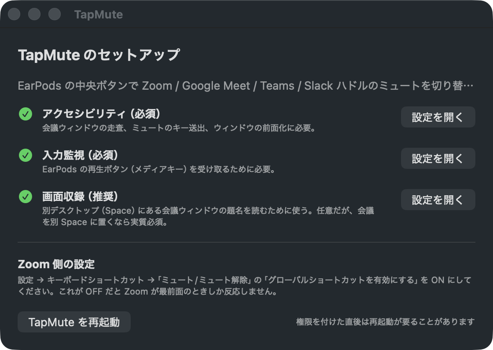
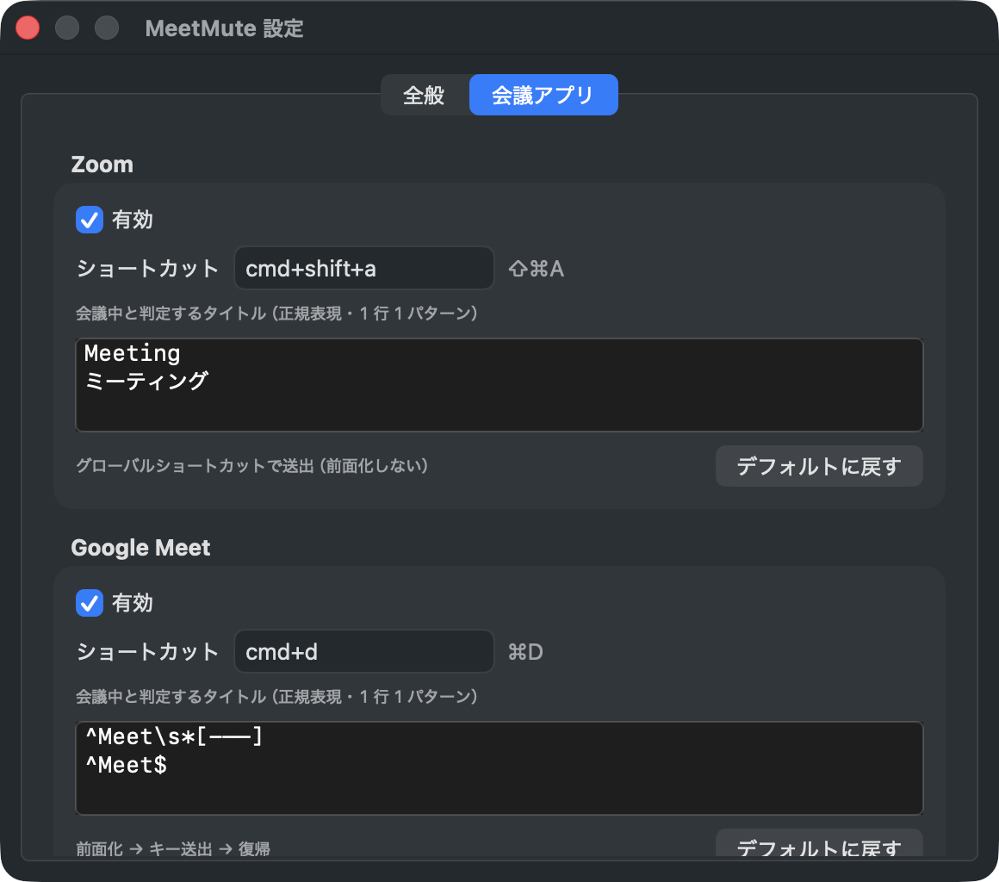

# TapMute

English | [日本語](README.ja.md)

A macOS menu bar app that toggles mute in **Zoom / Google Meet / Microsoft Teams**
with the center button of your EarPods.

It only intercepts the media key while a meeting is detected. With no meeting,
the button keeps working as ordinary play/pause for your music.


## How it works

```
EarPods center button
   ↓
MeetingDetector (scans in the background every 3s; the key press only reads the cache)
   ↓
meeting found ──→ NowPlayingShield holds the "Now Playing" role
                  → the media key is delivered to TapMute instead of Music
                  → MuteController sends  Zoom        : ⇧⌘A (global shortcut, no focus change)
                                          Meet / Teams: focus → key → restore focus
no meeting    ──→ the role is not held → your music app responds as usual
```

### Why swallowing the event is not enough

The obvious implementation is to grab the media key with a `CGEventTap` and consume it.
**That does not work on this version of macOS.** Both tap locations were measured on real hardware:

| Tap location | Sees the PLAY key | Result of consuming it |
|---|---|---|
| `cgSessionEventTap` | yes | **Music still launches** |
| `cghidEventTap` | yes | **Music still launches** |

Now-playing delivery (`mediaremoted`) lives outside the CG event pipeline, so consuming
the event does not stop it. That is the cause of "it muted, but my music started playing too".

The only thing that works is **taking over the Now Playing role**: register commands on
`MPRemoteCommandCenter` and play a silent loop so the system considers this app the current
player. Media keys are then routed here instead of to Music. Taking the role **only while a
meeting is detected** is essential — holding it permanently would break music control.

The event tap is still used, to learn the moment the button is pressed (it is earlier and more
reliable than the command path). The Now Playing command handler is normally just a shield that
absorbs the command; it performs the mute itself only when the tap is not running, for example
when Input Monitoring has been revoked.

### Reading the current mute state

**Read the label of the control that toggles mute.** A button always describes the action it
will perform, so a button offering "unmute" means you are currently muted. Measured labels:

| App | Muted | Unmuted | Depth |
|---|---|---|---|
| Zoom | 自分のオーディオをミュート解除する | 自分のオーディオをミュートする | shallow |
| Teams | マイクのミュートを解除 | マイクのミュート | ~20 |
| Meet | Turn on microphone / マイクをオンにする | Turn off microphone / マイクをオフにする | ~15 |

Note that Japanese phrasing differs between apps: Zoom joins the words as `ミュート解除する`
while Teams inserts a particle, `ミュートを解除`. Substring matching therefore needs both forms.

As a fallback, when no button is found, phrases that describe the *state* (`ミュートされた` /
`ミュート解除された`) are also read. **State words and action words must never share one list**:
`ミュート解除` is an action in Zoom (meaning you are muted right now) but part of a state
description in the Teams video tile (meaning you are unmuted). Keeping them in one list
guarantees a misread in one of the two apps, so they live in separate lists.

The classifier is pure and can be checked against the strings captured from the real apps:

```sh
./build/probe --probe-mute-markers
```

### Reading page content in browsers

Chromium-based browsers (Chrome / Dia / Arc / Edge) **do not build an accessibility tree for
page content by default**. Without it, a browser window exposes only ~100 nodes and the Meet
mute button is unreachable. Setting `AXManualAccessibility` on the application element makes
Chromium build it (the same mechanism screen readers rely on). TapMute sets it only while a
meeting is detected, so it is not a permanent cost.

Note that **the CoreAudio "input running" flag cannot be used for mute state**. Zoom keeps the
input stream open while muted, so it always reads as active (verified on real hardware). It is a
useful hint for "a call is in progress", but not for mute state.

## Supported apps

| App | Default shortcut | Default title patterns (regex) | Needs focus |
|---|---|---|---|
| Zoom (`us.zoom.xos`) | ⇧⌘A | `Meeting` / `ミーティング` | no |
| Google Meet (Chrome / Dia / Arc / Edge / Brave / PWA) | ⌘D | `^Meet\s*[-–—]` / `^Meet$` | yes |
| Microsoft Teams (`com.microsoft.teams2`) | ⇧⌘M | `Meeting` / `会議` / `ミーティング` | yes |

- Meet is detected **even in a background tab**. The tab is switched for a moment, ⌘D is sent,
  then the previous tab and the previously active app are restored.
- Title patterns vary by app version and UI language, so they are **editable in Settings**.

## Switching audio devices automatically

When a device whose name matches appears, TapMute makes it the system input and output.
macOS usually switches the *output* to a newly connected USB headset on its own but leaves the
*input* on the built-in microphone; this closes that gap.

Only devices that were absent a moment earlier are acted on, so a device you picked by hand is
never overridden. Names are matched as regexes and edited in Settings (default: `EarPods`).

With the headset plugged in, check what would match:

```sh
./build/probe --probe-audio
```

### Wired and USB-C EarPods

Both should behave identically here. The 3.5 mm button is decoded by the jack circuitry, while
USB-C EarPods send HID consumer-control usages; macOS turns both into the same `NX_SYSDEFINED`
media key, which is all this app looks at. Only the 3.5 mm variant has been verified on real
hardware so far — `make probe-keys` confirms any headset in a few seconds.

## Permissions

| Permission | Required | Used for |
|---|---|---|
| Accessibility | yes | Scanning windows, sending the shortcut, bringing windows forward |
| Input Monitoring | yes | Receiving the media key. Without it `CGEvent.tapCreate` returns nil and the app goes silent |
| Screen Recording | recommended | **Reading titles of meeting windows on another desktop (Space)** |

Screen Recording is "recommended" because of a macOS behaviour found while building this:
`kAXWindowsAttribute` **only returns windows on the current Space**. If you keep the meeting on
another desktop while working in front, accessibility alone reports zero windows and detection
goes quiet. TapMute combines three sources to avoid that:

1. `kAXWindows` — current Space. Yields AX elements, so focusing and tab switching are possible
2. `kAXMainWindow` / `kAXFocusedWindow` — still returns a title for apps on another Space
3. `CGWindowList` — spans all Spaces, but titles require Screen Recording



## Privacy

**This app performs no network communication.** There is no networking API anywhere in the
source; verify it yourself:

```sh
git grep -n -E "URLSession|NSURLConnection|Network\.|socket|http" -- Sources
```

(The only hit is the `x-apple.systempreferences:` URL used to open System Settings.)

What it reads — window titles and mute state — is used to render the menu bar and nothing else.
It is never stored or transmitted. The one thing written to disk is the "Log window list" menu
item, which writes to a temp file and the clipboard, and only when you run it.

Given that the app asks for Accessibility, Input Monitoring and Screen Recording, what it does
*not* do is stated here explicitly.

## Build and install

```sh
make            # produces build/TapMute.app
make run        # build and launch
make install    # copy to /Applications
make clean
```

A setup window appears on first launch. Grant the three permissions there and **restart TapMute**.

### Zoom setup (required)

Zoom → Settings → Keyboard Shortcuts → enable **"Enable Global Shortcut"** for
Mute/Unmute Audio. Without it, Zoom only reacts while it is the frontmost app.

### Signing and TCC (why permissions survive rebuilds)

macOS ties a permission to an app through its **designated requirement**, which depends on how
the app is signed.

| Signing | Designated requirement | After a rebuild |
|---|---|---|
| Ad-hoc (`-`) | `cdhash H"114f…"` | **Reset every time**. One edited line makes it a different app |
| Developer ID / Apple Development | `identifier "io.github.genkitoyama.tapmute" and … certificate leaf[subject.OU] = <TeamID>` | **Preserved** |

The Makefile picks up a Developer ID or Apple Development identity automatically from
`security find-identity -v -p codesigning`, and falls back to ad-hoc when there is none.

```sh
make install                                          # detect an identity automatically
make install SIGN_IDENTITY="Apple Development: ..."   # or name one explicitly
```

Right after switching signing methods the requirement changes, so permissions have to be granted
once more. A stale entry causes a silent denial, so reset it before granting again:

```sh
for s in Accessibility ListenEvent ScreenCapture; do tccutil reset $s io.github.genkitoyama.tapmute; done
```

## When detection fails

1. **While in a meeting**, choose "Log window list" from the menu. Every window title is copied
   to the clipboard
2. Find the real title of the meeting window
3. Settings → Meeting apps → add a pattern matching it



The same checks are available from the terminal, running with your terminal's own permissions,
which is useful before granting anything to the app itself:

```sh
make probe-windows                    # detection result and every window title
make probe-keys                       # whether the media key arrives at all
./build/probe --probe-mute-markers    # mute-label classification test
./build/probe --probe-audio           # audio devices and which ones would be switched to
```

### False positives (the button does nothing outside a meeting)

Settings → General → **"Treat as a meeting only while the mic is in use"**. Conferencing apps
keep the input stream open even while muted, so unmuting still works with this on.

## Known limitations

- Focusing Meet / Teams **switches Spaces** if the meeting window lives on another desktop or is
  full screen. macOS requires focus to deliver a key, so this cannot be avoided
- Meet in a background tab is only found while that browser window is **on the current Space**
  (the tab list is reachable through accessibility only)
- When the mute state cannot be read, the icon falls back to the plain shape and the menu says
  the state is unknown. Displaying a state that cannot be verified would be a lie

## Tested on

macOS 26.5 / Apple Silicon.

| Item | Status |
|---|---|
| Zoom (`us.zoom.xos`) | detection, mute toggle, state display |
| Google Meet (Dia / Chrome tab) | detection, mute toggle, state display |
| Microsoft Teams (`com.microsoft.teams2`) | detection, mute toggle, state display |
| Media key pass-through outside meetings | music app responds normally |
| Music suppression during meetings | blocked by holding Now Playing |
| Meetings on another desktop (Space) | detected through CGWindowList |
| Permissions after a rebuild | preserved with a stable signing identity |

Both Japanese and English UI wording is handled (measured with Zoom in Japanese and Meet in English).

## Layout

```
Sources/
  main.swift                entry point / CLI probes
  AppDelegate.swift         startup, wiring, what a key press does
  MediaKeyTap.swift         media key press detection
  NowPlayingShield.swift    holds Now Playing while in a meeting
  MeetingDetector.swift     meeting detection (3s cache + workspace notifications)
  MeetingProfile.swift      per-app differences held as values
  MuteController.swift      performing the mute (including the focus round trip)
  MuteStateReader.swift     reading the current mute state from accessibility
  AccessibilityHelper.swift accessibility and WindowServer wrappers (the three sources)
  MicMonitor.swift          input device activity (CoreAudio)
  AudioDevices.swift        CoreAudio device list and system default devices
  AudioDeviceSwitcher.swift switches input/output when a matching device appears
  StatusBarController.swift menu bar UI and toast
  PermissionManager.swift   permission checks and guidance
  OnboardingWindow.swift    setup window
  SettingsWindow.swift      settings window
  Preferences.swift         persistence
  Shortcut.swift            "cmd+shift+a" ↔ key code, and sending it
```

## License

MIT
